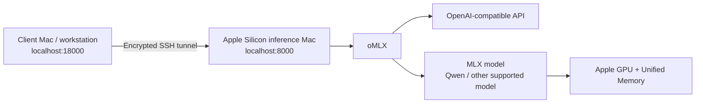

# oMLX Local AI Server

<p align="center">
  <strong>Turn an Apple Silicon Mac into a private, OpenAI-compatible local inference server with oMLX.</strong>
</p>

<p align="center">
  
  
  
  
  
  
</p>

Run capable local LLMs on Apple Silicon, expose them through an OpenAI-compatible API, access them securely over SSH, tune memory usage, enable Lightning MTP, benchmark real throughput, and automate common operations with a `Makefile`.

> [!IMPORTANT]
> This guide includes a **tested profile for a Mac mini M5 Pro with 24 GB unified memory**, but the general setup is reusable across Apple Silicon Macs.
>
> Performance numbers in this repository are measurements from one machine, not guarantees.

---

## Contents

- [What this builds](#what-this-builds)
- [Tested configuration](#tested-configuration)
- [Observed performance](#observed-performance)
- [Quick start](#quick-start)
- [Requirements](#requirements)
- [Install oMLX](#install-omlx)
- [Install the Hugging Face CLI](#install-the-hugging-face-cli)
- [Download a model](#download-a-model)
- [Start oMLX](#start-omlx)
- [Configure API authentication](#configure-api-authentication)
- [Test the API](#test-the-api)
- [Remote access with SSH](#remote-access-with-ssh)
- [Lightning MTP](#lightning-mtp)
- [Memory guard and memory tuning](#memory-guard-and-memory-tuning)
- [Benchmarking](#benchmarking)
- [Run oMLX as a background service](#run-omlx-as-a-background-service)
- [Makefile automation](#makefile-automation)
- [Use oMLX from Python](#use-omlx-from-python)
- [Troubleshooting](#troubleshooting)
- [Security](#security)
- [Useful paths](#useful-paths)
- [Known-good M5 Pro 24 GB profile](#known-good-m5-pro-24-gb-profile)
- [Contributing benchmarks](#contributing-benchmarks)

---

# What this builds



The recommended setup keeps oMLX bound to the inference Mac's own `localhost`.

The client machine reaches it through an SSH tunnel:

```text
Client
http://localhost:18000/v1
        │
        │ SSH tunnel
        ▼
Inference Mac
http://localhost:8000/v1
        │
        ▼
      oMLX
```

> [!TIP]
> Keeping oMLX on `localhost` and tunneling over SSH is safer than exposing port `8000` directly to your LAN or the Internet.

---

# Tested configuration

The reference system used while building and benchmarking this guide:

| Component | Value |
|---|---|
| Machine | Mac mini |
| SoC | Apple M5 Pro |
| Architecture | `arm64` |
| Unified memory | 24 GiB |
| macOS | 27.0 |
| oMLX | 0.7.0 |
| Model | `Jundot/Qwen3.8-27B-oQ4e-mtp` |
| Model disk usage | ~16 GiB |
| Lightning MTP | Enabled |
| Adaptive MTP depth | 3 |
| Memory guard | Aggressive |

Check your own system:

```bash
sw_vers
uname -m
sysctl -n hw.memsize
```

Convert physical memory to GiB:

```bash
python3 - <<'PY'
import subprocess

memory_bytes = int(
    subprocess.check_output(["sysctl", "-n", "hw.memsize"]).decode().strip()
)

print(f"{memory_bytes / 1024**3:.0f} GiB")
PY
```

---

# Observed performance

The reference machine was benchmarked with long code-generation prompts.

## Baseline vs Lightning MTP

| Configuration | TTFT | Decode speed | Total time |
|---|---:|---:|---:|
| Baseline, no MTP | 0.53 s | 16.91 tok/s | 59.66 s |
| MTP depth 3, warm | **0.27 s** | **26.09 tok/s** | **38.60 s** |
| MTP depth 3, second long prompt | 0.83 s | **27.07 tok/s** | 45.16 s |

Approximate sustained decode rate with Lightning MTP:

```text
26–27 output tokens/second
```

That was roughly a **54% improvement** over the measured baseline on the tested machine.

> [!NOTE]
> Real throughput depends on model, quantization, prompt length, context length, cache state, macOS version, oMLX version, memory pressure, thermals, and background workloads.

---

# Quick start

Use this checklist if you already know what you are doing:

- [ ] Install oMLX.
- [ ] Install the Hugging Face CLI.
- [ ] Download a compatible MLX model.
- [ ] Start `omlx serve`.
- [ ] Confirm `/v1/models`.
- [ ] Configure an API key.
- [ ] Export `OMLX_API_KEY`.
- [ ] Test `/v1/chat/completions`.
- [ ] Enable Lightning MTP if supported.
- [ ] Check memory pressure and swap.
- [ ] Benchmark a warm request.
- [ ] Optionally configure the background service.
- [ ] Optionally configure an SSH tunnel.

---

# Requirements

You need:

- an Apple Silicon Mac;
- Homebrew;
- enough free disk space for the model;
- enough unified memory for the chosen model and quantization;
- SSH enabled if you want remote access.

Check Homebrew:

```bash
brew --version
```

Check available storage:

```bash
df -h ~
```

> [!TIP]
> For larger models, leave significantly more free disk space than the final model size. Downloads may temporarily require additional space while shards are reconstructed.

---

# Install oMLX

Add the oMLX Homebrew tap:

```bash
brew tap jundot/omlx https://github.com/jundot/omlx
```

Install oMLX:

```bash
brew install jundot/omlx/omlx
```

Verify:

```bash
omlx --version
which omlx
```

Example from the tested machine:

```text
0.7.0
/opt/homebrew/bin/omlx
```

Check whether the Homebrew service is running:

```bash
brew services info omlx
```

> [!NOTE]
> The Homebrew installation can pull in large dependencies such as Python, Rust, and LLVM. The installation footprint may therefore be much larger than the oMLX executable itself.

For initial setup, keeping the managed service stopped is useful because running oMLX manually exposes logs directly in your terminal.

---

# Install the Hugging Face CLI

Install the current CLI:

```bash
brew install hf
```

Verify:

```bash
hf version
```

Public repositories can be downloaded without authentication.

Optional login:

```bash
hf auth login
```

> [!WARNING]
> Never commit Hugging Face access tokens to Git.

---

# Download a model

The tested model is:

```text
Jundot/Qwen3.8-27B-oQ4e-mtp
```

Create the default model directory:

```bash
mkdir -p ~/.omlx/models
```

Download:

```bash
hf download Jundot/Qwen3.8-27B-oQ4e-mtp \
  --local-dir ~/.omlx/models/Qwen3.8-27B-oQ4e-mtp
```

Verify disk usage:

```bash
du -sh ~/.omlx/models/Qwen3.8-27B-oQ4e-mtp
```

Inspect the directory:

```bash
ls -lh ~/.omlx/models/Qwen3.8-27B-oQ4e-mtp
```

<details>
<summary><strong>Expected files for the tested Qwen model</strong></summary>

```text
README.md
chat_template.jinja
config.json
generation_config.json
merges.txt
model-00001-of-00004.safetensors
model-00002-of-00004.safetensors
model-00003-of-00004.safetensors
model-00004-of-00004.safetensors
model.safetensors.index.json
oq_imatrix_report.json
preprocessor_config.json
tokenizer.json
tokenizer_config.json
vocab.json
```

</details>

> [!IMPORTANT]
> Wait until the Hugging Face client finishes both downloading and reconstructing the model before starting oMLX.

---

# Start oMLX

Run the server in the foreground:

```bash
omlx serve
```

The default endpoints are:

| Purpose | URL |
|---|---|
| API root | `http://localhost:8000/v1` |
| Models | `http://localhost:8000/v1/models` |
| Chat completions | `http://localhost:8000/v1/chat/completions` |
| Admin UI | `http://localhost:8000/admin` |

Leave the terminal running.

To stop the foreground server:

<kbd>Ctrl</kbd> + <kbd>C</kbd>

---

## Verify model discovery

From a second terminal:

```bash
curl -s http://localhost:8000/v1/models
```

Before authentication is configured, a detected model should appear in the response.

Example:

```json
{
  "object": "list",
  "data": [
    {
      "id": "Qwen3.8-27B-oQ4e-mtp",
      "object": "model",
      "owned_by": "omlx",
      "max_model_len": 262144
    }
  ]
}
```

> [!WARNING]
> `max_model_len` describes a model capability. It does **not** mean your Mac has enough memory to use that full context window safely.

---

# Configure API authentication

Open:

```text
http://localhost:8000/admin
```

On first setup, the admin panel can prompt you to create an API key.

## Generate a strong key

Use OpenSSL:

```bash
openssl rand -hex 32
```

This produces 32 random bytes encoded as 64 hexadecimal characters.

Paste the generated value into:

```text
API Key
Confirm API Key
```

Then save it through the admin UI.

> [!CAUTION]
> Treat the API key as a secret.
>
> Do not paste it into:
>
> - GitHub issues;
> - screenshots;
> - README files;
> - committed shell scripts;
> - `Makefile`;
> - public chat messages;
> - `.env.example`.

---

## Load the key into the current shell

With `zsh`:

```bash
read -s "OMLX_API_KEY?oMLX API key: "
echo
export OMLX_API_KEY
```

Verify only that the variable exists:

```bash
test -n "$OMLX_API_KEY" && echo "OMLX_API_KEY is set"
```

Remove it later:

```bash
unset OMLX_API_KEY
```

> [!TIP]
> This avoids putting the secret directly into your shell command history.

---

# Test the API

## List models

```bash
curl -s http://localhost:8000/v1/models \
  -H "Authorization: Bearer $OMLX_API_KEY" \
  | python3 -m json.tool
```

---

## Chat completion

```bash
curl -s http://localhost:8000/v1/chat/completions \
  -H "Authorization: Bearer $OMLX_API_KEY" \
  -H "Content-Type: application/json" \
  -d '{
    "model": "Qwen3.8-27B-oQ4e-mtp",
    "messages": [
      {
        "role": "user",
        "content": "Write a concise Python function that returns the nth Fibonacci number iteratively."
      }
    ],
    "temperature": 0.2,
    "max_tokens": 200
  }' \
  | python3 -m json.tool
```

---

## Streaming

```bash
curl -N http://localhost:8000/v1/chat/completions \
  -H "Authorization: Bearer $OMLX_API_KEY" \
  -H "Content-Type: application/json" \
  -d '{
    "model": "Qwen3.8-27B-oQ4e-mtp",
    "messages": [
      {
        "role": "user",
        "content": "Explain dependency injection in FastAPI."
      }
    ],
    "stream": true,
    "max_tokens": 500
  }'
```

---

# Remote access with SSH

The recommended architecture is:

```text
oMLX            -> localhost only
Remote access   -> SSH tunnel
```

## Same local port

Run this on the **client machine**:

```bash
ssh -N -L 8000:localhost:8000 user@MAC_IP
```

The remote oMLX instance becomes available locally at:

```text
http://localhost:8000
```

---

## Recommended: use a different local port

Using `18000` avoids conflicts with a local development server:

```bash
ssh -N -L 18000:localhost:8000 user@MAC_IP
```

Then use:

```text
API:   http://localhost:18000/v1
Admin: http://localhost:18000/admin
```

> [!IMPORTANT]
> Run the tunnel command on the client machine, not inside the SSH session running on the inference Mac.

> [!TIP]
> Keep oMLX bound to `localhost`. The SSH connection provides the remote transport.

---

# Lightning MTP

Lightning MTP can accelerate decoding on supported model architectures/checkpoints.

For the tested model:

```text
Qwen3.8-27B-oQ4e-mtp
```

open:

```text
http://localhost:8000/admin
```

or, through the SSH tunnel:

```text
http://localhost:18000/admin
```

Select the model and configure:

```text
Lightning MTP: ON
Adaptive max depth: 3
```

The tested M5 Pro 24 GB system achieved approximately:

```text
16.9 tok/s -> 26–27 tok/s
```

when moving from the baseline to Lightning MTP depth 3.

> [!WARNING]
> A larger MTP depth does **not** automatically mean better performance.
>
> Higher values can increase memory usage and may not improve accepted-token efficiency.
>
> Benchmark every configuration on your own machine.

> [!NOTE]
> Changing MTP settings can trigger a model/runtime reload. Do not use the first request immediately after a configuration change as your steady-state benchmark.

---

# Memory guard and memory tuning

Large MLX models can consume most of the available unified memory while still remaining usable.

Useful commands:

```bash
top -l 1 | grep -E "PhysMem|VM:"
```

```bash
memory_pressure
```

```bash
vm_stat
```

```bash
sysctl vm.swapusage
```

Inspect the oMLX process:

```bash
ps -axo pid,rss,vsz,command | grep '[o]mlx'
```

---

## Apple Silicon memory behavior

> [!NOTE]
> Process RSS does **not** necessarily represent the complete memory footprint of an MLX workload.
>
> MLX/Metal allocations can appear as wired or system-wide unified memory. A process showing a relatively small RSS may still be responsible for much larger GPU/unified-memory allocations.

Evaluate memory using several signals together:

- `memory_pressure`;
- swap usage;
- pageouts;
- throttled pages;
- system responsiveness;
- oMLX errors.

---

## Memory guard

oMLX supports memory guard tiers such as:

```text
safe
balanced
aggressive
custom
```

On the tested 24 GB machine, the initial request for the 27B model was aborted by the memory guard during prefill.

Moving to the **aggressive** tier allowed the model to run successfully.

> [!CAUTION]
> `aggressive` is not a universal recommendation.
>
> It allows oMLX to operate closer to the system's memory limit. On a 24 GB machine, that can leave macOS with much less headroom.
>
> Always inspect:
>
> ```bash
> memory_pressure
> sysctl vm.swapusage
> ```
>
> before and after changing the guard tier.

> [!WARNING]
> Do not disable memory safeguards as your first troubleshooting step. A real out-of-memory condition can affect the entire desktop session.

---

# Benchmarking

A useful benchmark should measure more than one short response.

Record:

| Metric | Why it matters |
|---|---|
| Model load time | Cold-start cost |
| TTFT | Perceived responsiveness |
| Prompt tok/s | Prefill/input processing |
| Generation tok/s | Decode speed |
| Total time | End-to-end latency |
| Swap usage | Memory headroom |
| Memory pressure | System health |
| Cold vs warm run | Cache/load effects |

oMLX exposes timing metrics in the response `usage` object.

Example:

```json
{
  "time_to_first_token": 0.27,
  "generation_tokens_per_second": 26.09,
  "total_time": 38.60
}
```

---

## Repeatable long-generation benchmark

```bash
curl -s http://localhost:8000/v1/chat/completions \
  -H "Authorization: Bearer $OMLX_API_KEY" \
  -H "Content-Type: application/json" \
  -d '{
    "model": "Qwen3.8-27B-oQ4e-mtp",
    "messages": [
      {
        "role": "user",
        "content": "Create a production-style FastAPI endpoint for creating users. Use Pydantic validation, proper HTTP status codes, dependency injection, error handling, and explain the important design decisions. Keep the code self-contained."
      }
    ],
    "temperature": 0.2,
    "max_tokens": 1000
  }' \
  | python3 -m json.tool
```

Run it at least twice:

```text
Run 1 -> cold / recently reconfigured
Run 2 -> warm
```

Use the warm run for steady-state comparisons.

---

## Check memory after the benchmark

```bash
memory_pressure
sysctl vm.swapusage
```

> [!TIP]
> Benchmark the workload you actually care about. Coding, short chat, long context, RAG, agentic tool use, and batch inference stress different parts of the runtime.

---

# Run oMLX as a background service

Once your configuration is stable, you can stop launching oMLX manually.

Start:

```bash
omlx start
```

Stop:

```bash
omlx stop
```

Restart:

```bash
omlx restart
```

Check status:

```bash
brew services info omlx
```

Equivalent Homebrew commands:

```bash
brew services start omlx
brew services stop omlx
brew services restart omlx
brew services info omlx
```

> [!NOTE]
> When running Homebrew service commands over SSH, macOS can display warnings related to `/dev/console` ownership or the `user/*` launchd domain. Verify the actual service state with `brew services info omlx`.

---

# Makefile automation

A simple project-level `Makefile` can expose the most common operations.

Suggested targets:

```text
make help
make serve
make start
make stop
make restart
make status
make models
make test
make memory
make logs
make version
```

Example:

```make
SHELL := /bin/zsh

MODEL ?= Qwen3.8-27B-oQ4e-mtp
BASE_URL ?= http://localhost:8000
BREW_PREFIX := $(shell brew --prefix)

.PHONY: help serve start stop restart status check-key models test memory logs version

help:
	@echo "oMLX Local AI Server"
	@echo ""
	@echo "  make serve    Run oMLX in the foreground"
	@echo "  make start    Start the managed oMLX service"
	@echo "  make stop     Stop the managed oMLX service"
	@echo "  make restart  Restart the managed oMLX service"
	@echo "  make status   Show Homebrew service status"
	@echo "  make models   List API models"
	@echo "  make test     Run a short inference test"
	@echo "  make memory   Show memory pressure and swap"
	@echo "  make logs     Follow oMLX logs"
	@echo "  make version  Show oMLX version"

serve:
	omlx serve

start:
	omlx start

stop:
	omlx stop

restart:
	omlx restart

status:
	brew services info omlx

version:
	omlx --version

check-key:
	@test -n "$$OMLX_API_KEY" || \
		(echo "OMLX_API_KEY is not set."; \
		 echo 'Run: read -s "OMLX_API_KEY?oMLX API key: "; echo; export OMLX_API_KEY'; \
		 exit 1)

models: check-key
	@curl -fsS "$(BASE_URL)/v1/models" \
		-H "Authorization: Bearer $$OMLX_API_KEY" \
		| python3 -m json.tool

test: check-key
	@curl -fsS "$(BASE_URL)/v1/chat/completions" \
		-H "Authorization: Bearer $$OMLX_API_KEY" \
		-H "Content-Type: application/json" \
		-d '{"model":"$(MODEL)","messages":[{"role":"user","content":"Reply with exactly: oMLX is working"}],"temperature":0,"max_tokens":32}' \
		| python3 -m json.tool

memory:
	@memory_pressure
	@echo ""
	@sysctl vm.swapusage

logs:
	@touch "$(HOME)/.omlx/logs/server.log" "$(BREW_PREFIX)/var/log/omlx.log"
	tail -F "$(HOME)/.omlx/logs/server.log" "$(BREW_PREFIX)/var/log/omlx.log"
```

Load the API key before authenticated targets:

```bash
read -s "OMLX_API_KEY?oMLX API key: "
echo
export OMLX_API_KEY
```

Then:

```bash
make models
make test
```

> [!IMPORTANT]
> Do not hardcode your real API key in the `Makefile`.

---

# Use oMLX from Python

Install the OpenAI Python client:

```bash
python3 -m pip install openai
```

Example:

```python
import os

from openai import OpenAI


client = OpenAI(
    base_url="http://localhost:8000/v1",
    api_key=os.environ["OMLX_API_KEY"],
)

response = client.chat.completions.create(
    model="Qwen3.8-27B-oQ4e-mtp",
    messages=[
        {
            "role": "user",
            "content": "Explain hexagonal architecture in Python.",
        }
    ],
)

print(response.choices[0].message.content)
```

When using the SSH tunnel on local port `18000`:

```python
client = OpenAI(
    base_url="http://localhost:18000/v1",
    api_key=os.environ["OMLX_API_KEY"],
)
```

Your application does not need to know that inference is physically running on another Mac.

---

# Troubleshooting

<details>
<summary><strong><code>hf: command not found</code></strong></summary>

Install the Hugging Face CLI:

```bash
brew install hf
```

Verify:

```bash
hf version
```

</details>

---

<details>
<summary><strong><code>/v1/models</code> returns an empty list</strong></summary>

Check the model directory:

```bash
ls ~/.omlx/models
```

Check the specific model:

```bash
ls ~/.omlx/models/Qwen3.8-27B-oQ4e-mtp
```

Restart oMLX:

```bash
omlx restart
```

If you are still configuring the runtime manually, restart the foreground process instead.

</details>

---

<details>
<summary><strong>API authentication error</strong></summary>

Authenticated requests require:

```bash
-H "Authorization: Bearer $OMLX_API_KEY"
```

Check that the variable exists:

```bash
test -n "$OMLX_API_KEY" && echo "API key loaded"
```

Do not print the key itself.

</details>

---

<details>
<summary><strong>oMLX memory guard aborted the request</strong></summary>

Inspect:

```bash
memory_pressure
sysctl vm.swapusage
```

Then try, in order:

1. close memory-heavy applications;
2. reduce context length;
3. reduce request concurrency;
4. use a smaller model or lower-memory quantization;
5. move to a less conservative memory guard tier only if your system has sufficient headroom.

> [!CAUTION]
> Do not immediately disable memory protection.

</details>

---

<details>
<summary><strong>macOS reports almost all RAM as used</strong></summary>

This can be expected with large MLX workloads.

Check:

```bash
memory_pressure
sysctl vm.swapusage
```

A high `PhysMem used` number alone does not prove that the system is thrashing.

Look for:

```text
Pages throttled
Pageouts
Swap used
System-wide memory free percentage
```

and evaluate system responsiveness.

</details>

---

<details>
<summary><strong>Port 8000 is already in use</strong></summary>

Find the listener:

```bash
lsof -nP -iTCP:8000 -sTCP:LISTEN
```

For a remote SSH tunnel, choose a different local port:

```bash
ssh -N -L 18000:localhost:8000 user@MAC_IP
```

</details>

---

# Security

Recommended practices:

- keep oMLX bound to `localhost`;
- use an SSH tunnel for remote access;
- configure API authentication;
- generate secrets with `openssl rand`;
- keep real secrets out of Git;
- keep `.env` ignored;
- do not expose port `8000` directly to the public Internet;
- use a private VPN such as Tailscale if you need broader remote access;
- rotate the API key if it is ever exposed.

Generate a replacement key:

```bash
openssl rand -hex 32
```

> [!CAUTION]
> If you expose oMLX beyond localhost, API authentication alone should not be treated as a complete Internet-facing security architecture.

---

# Useful paths

| Purpose | Path |
|---|---|
| Models | `~/.omlx/models` |
| Settings | `~/.omlx/settings.json` |
| Server logs | `~/.omlx/logs/server.log` |
| Homebrew oMLX log | `$(brew --prefix)/var/log/omlx.log` |
| Homebrew binary on tested machine | `/opt/homebrew/bin/omlx` |

---

# Known-good M5 Pro 24 GB profile

This section records the exact profile validated while creating this guide.

> [!IMPORTANT]
> Treat this as a reproducible reference point, not as a universal recommendation.

## Hardware

```text
Mac mini
Apple M5 Pro
24 GB unified memory
arm64
```

## Software

```text
macOS 27.0
oMLX 0.7.0
```

## Model

```text
Jundot/Qwen3.8-27B-oQ4e-mtp
~16 GiB on disk
```

## Runtime configuration

```text
API authentication: enabled
Memory guard: aggressive
Lightning MTP: enabled
Adaptive max depth: 3
```

## Baseline

```text
Prompt tokens:        93
Completion tokens:    1000
TTFT:                 0.53 s
Generation:           16.91 tok/s
Total time:           59.66 s
```

## MTP warm benchmark

```text
Prompt tokens:        93
Completion tokens:    1000
Cached prompt tokens: 88
TTFT:                 0.27 s
Generation:           26.09 tok/s
Total time:           38.60 s
```

## Second long prompt

```text
Prompt tokens:        101
Completion tokens:    1200
TTFT:                 0.83 s
Prompt processing:    121.79 tok/s
Generation:           27.07 tok/s
Total time:           45.16 s
```

## Memory observed with MTP enabled

```text
System-wide memory free percentage: 24%
Pages throttled:                     0
Pageouts:                            17
Swap used:                           ~182.62 MB
```

Earlier in the same session, before the MTP testing sequence, observed swap usage was approximately:

```text
15.56 MB
```

> [!NOTE]
> macOS swap counters and memory state are dynamic. These values describe one observed session and should not be interpreted as fixed requirements.

---

# Contributing benchmarks

Community benchmark contributions are welcome.

Please include enough information to make the result reproducible:

```text
Mac model:
SoC:
GPU cores:
Unified memory:
macOS:
oMLX version:

Model:
Quantization:
Model size:

Context:
Prompt tokens:
Completion tokens:

Memory guard:
Lightning MTP:
MTP depth:

Model load time:
TTFT:
Prompt tok/s:
Generation tok/s:
Total time:

memory_pressure:
Swap usage:
```

> [!TIP]
> Include both a cold and a warm request when possible. Warm throughput is much easier to compare across systems.

---

# References

- [oMLX](https://github.com/jundot/omlx)
- [Hugging Face](https://huggingface.co/)
- [Jundot/Qwen3.8-27B-oQ4e-mtp](https://huggingface.co/Jundot/Qwen3.8-27B-oQ4e-mtp)

---

## Disclaimer

Local inference performance and memory behavior can change significantly between macOS, MLX, oMLX, model, and quantization versions.

Benchmark the exact configuration you intend to use before relying on it for production workloads.
